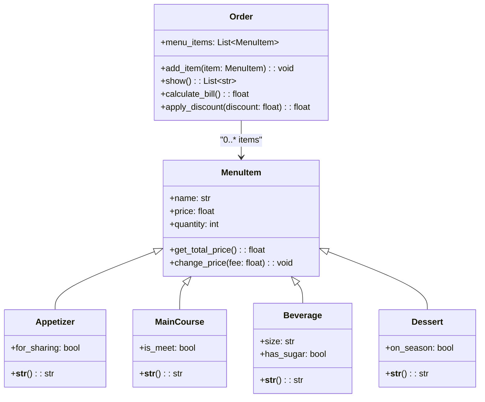

# Reto3-POO-SFGT

-----
En este repositorio se encuentran las soluciones a los dos ejercicios solicitados por el profesor, la clase `Rectangle` y `Order`.
  
## ¡Acceso directo a lo importante!

1. [**Clase Rectangle**](#4-clase-rectangle)
2. [**Clase Order**](#clase-order)

---
# Documentación del Código: Clase Rectangle

## 1. Explicación del Diseño de Clases

Pues principalmente se usó la abstracción para concretar que es un punto y una línea. Ya a partir de aquí fue más sencillo crear la clase `Rectangle` porque se inicializa con puntos o con líneas.

### Clases Principales
1. **`Point`**: Representa un punto en un plano cartesiano.
2. **`Line`**: Representa una línea definida por dos puntos.
3. **`Rectangle`**: Modela un rectángulo que puede ser definido de varias formas, incluyendo esquinas, centro o líneas opuestas.
4. **`Square`**: Clase que hereda de `Rectangle`.

---

## 2. Clase `Point`

La clase `Point` modela un punto en un plano cartesiano con coordenadas \(x\) e \(y\). Incluye métodos para calcular distancias entre puntos y una representación en formato de texto por si alguien quiere saber la forma del punto y que no sea <Main.object...>

### Código de la Clase `Point`

```python
class Point:
    def __init__(self, x: float = 0, y: float = 0):
        self.x = x
        self.y = y

    def compute_distance(self, point: "Point") -> float:
        """Calcula la distancia entre dos puntos."""
        return ((self.x - point.x)**2 + (self.y - point.y)**2)**0.5

    def __str__(self) -> str:
        return f"({self.x}, {self.y})"
```
---

## 3. Clase `Line`

La clase `Line` representa una línea definida por dos puntos y ofrece métodos para calcular su longitud, pendiente y si hay intersecciones con los ejes. **BONUS** fue crear el método `discretize_line\(n\)` donde hasta tengo entendido es como un `numpy.linspace` pero hecho desde cero.

### Código de la Clase `Line`

```python
class Line:
    """Plantilla para representar una línea en un plano."""
    def __init__(self, point1: "Point", point2: "Point") -> None:
        self.point1 = point1
        self.point2 = point2
        self.length = self.compute_length()
        self.slope = self.compute_slope()
        self.line_points = []

    def compute_length(self) -> float:
        """Retorna la longitud de la línea."""
        length: float = ((self.point1.x - self.point2.x)**2 + (self.point1.y - self.point2.y)**2)**0.5
        return length

    def compute_slope(self):
        """Retorna en grados la pendiente de la línea."""
        co: int = abs(self.point1.y - self.point2.y)
        ca: int = abs(self.point1.x - self.point2.x)
        self.slope = (math.atan2(co, ca)) * (180/math.pi)
        return self.slope

    def compute_horizontal_cross(self) -> bool:
        """Verifica si hay intersección con el eje x."""
        if self.point1.y * self.point2.y <= 0:
            return True
        return False

    def compute_vertical_cross(self):
        """Verifica si hay intersección con el eje y."""
        if self.point1.x * self.point2.x <= 0:
            return True
        return False

    def discretize_line(self, n: int) -> list[str]:
        """Divide la línea en 'n' puntos distribuidos uniformemente."""
        self.line_points: list["Point"] = []

        # Hallar la distancia entre puntos
        distance_x: float = (self.point2.x-self.point1.x) / (n-1)
        distance_y: float = (self.point2.y-self.point1.y) / (n-1)
        # Crear n puntos
        for i in range(n):
            new_x: float = self.point1.x + (i * distance_x)
            new_y: float = self.point1.y + (i * distance_y)
            new_point = Point(new_x, new_y)
            self.line_points.append(new_point)

        return [str(point) for point in self.line_points]

    def __str__(self) -> str:
        return f"({self.point1.x}, {self.point1.y}) - ({self.point2.x}, {self.point2.y})"
```

---
## 4. Clase `Rectangle`

Representa un rectángulo en un plano. Esta clase tiene 4 formas de inicialización:

1. Por esquina inferior izquierda, ancho y alto.
Se calcula el centro automáticamente.

2. Por el centro, ancho y alto.
Define el rectángulo alrededor del punto central.

3. Por dos esquinas opuestas.
Determina el ancho y alto a partir de las coordenadas.

4. Por cuatro líneas adyacentes.
Verifica que las líneas formen un rectángulo válido y calcula ancho y alto.

Cuenta con métodos para saber si un punto se encuentra dentro de ese rectángulo, obtener área o perímetro. También es inteligente y sabe si las líneas que se pasan como la última forma de inicialización crean un rectángulo.
**BONUS** era crear un método `compute_interference_line`, pero solo reviso el caso base de si los extremos de la línea se encuentran dentro del rectángulo.

Uso un truco que chat GPT me otorgó para calcular múltiples condiciones con velocidad:
```python
if not all(conditions):
   raise ValueError("Introduzca líneas que formen un rectángulo.")
```

### Código de la Clase `Rectangle`

```python
class Rectangle:
    def __init__(self, method: int, *args):
        match method:
            case 1:
                # Caso esquina: esquina inferior izquierda, ancho y altura
                self.bl_corner, self.width, self.height = args
                new_x = (self.bl_corner.x + self.width) / 2
                new_y = (self.bl_corner.y + self.height) / 2
                self.center = Point(new_x, new_y)

            case 2:
                # Caso centro: centro, ancho y altura
                self.center, self.width, self.height = args

            case 3:
                # Caso esquinas opuestas
                self.corner1, self.corner2 = args

                if self.corner1.x == self.corner2.x and self.corner1.y == self.corner2.y:
                    raise ValueError("Seleccione puntos en diferentes ubicaciones del espacio.")

                self.width = abs(self.corner2.x - self.corner1.x)
                self.height = abs(self.corner2.y - self.corner1.y)

            case 4:
                # Caso definido por líneas
                self.line1, self.line2, self.line3, self.line4 = args
                opposite_lines = []

                for i in range(len(args)):
                    line = args[i]
                    x1, y1 = line.point1.x, line.point1.y
                    x2, y2 = line.point2.x, line.point2.y

                    for j in range(i + 1, len(args)):
                        next_line = args[j]
                        x3, y3 = next_line.point1.x, next_line.point1.y
                        x4, y4 = next_line.point2.x, next_line.point2.y

                        # Verificar puntos adyacentes
                        if not (
                            (x1 == x3 and y1 == y3) or (x1 == x4 and y1 == y4) or
                            (x2 == x3 and y2 == y3) or (x2 == x4 and y2 == y4)
                        ):
                            opposite_lines.append((line, next_line))

                if len(opposite_lines) != 2:
                    raise ValueError("Introduzca líneas que formen un rectángulo.")

                # Verificar propiedades del rectángulo
                line1, line3 = opposite_lines[0]
                line2, line4 = opposite_lines[1]

                conditions = [
                    line1.compute_length() == line3.compute_length(),
                    line2.compute_length() == line4.compute_length(),
                    line1.compute_slope() == line3.compute_slope(),
                    line2.compute_slope() == line4.compute_slope()
                ]

                if not all(conditions):
                    raise ValueError("Introduzca líneas que formen un rectángulo.")

                # Calcular ancho y altura
                self.width = line1.compute_length()
                self.height = line2.compute_length()

            case _:
                raise ValueError("Ningún método seleccionado.")

    def compute_area(self) -> float:
        """Calcula el área del rectángulo."""
        return self.width * self.height

    def compute_perimeter(self) -> float:
        """Calcula el perímetro del rectángulo."""
        return 2 * (self.width + self.height)

    def compute_interference_point(self, point: "Point") -> bool:
        """Verifica si un punto está dentro del rectángulo."""
        start_x, end_x = self.compute_width_range()
        start_y, end_y = self.compute_height_range()
        return (start_x <= point.x <= end_x) and (start_y <= point.y <= end_y)

    def compute_width_range(self) -> list[float]:
        """Obtiene el rango horizontal del rectángulo."""
        half_width = self.width / 2
        return [self.center.x - half_width, self.center.x + half_width]

    def compute_height_range(self) -> list[float]:
        """Obtiene el rango vertical del rectángulo."""
        half_height = self.height / 2
        return [self.center.y - half_height, self.center.y + half_height]

    def compute_interference_line(self, line: "Line") -> bool:
        """Verifica si una línea está dentro del rectángulo."""
        # Verificar si alguno de los extremos de la línea está dentro del rectángulo
        return (
            self.compute_interference_point(line.point1) or
            self.compute_interference_point(line.point2)
        )
```
---
## 5. Clase `Square`

La clase `Square` hereda de su clase padre `Rectangle`, y solo se inicializa con los primeros 3 métodos.

### Código de la Clase `Square`

```python
class Square(Rectangle):
    def __init__(self, method: int, *args):
        # Se llama a la clase padre y se inicializa
        if method == 1:
            super().__init__(1, args[0], args[1], args[1])
        elif method == 2:
            super().__init__(2, args[0], args[1], args[1])
        elif method == 3:
            super().__init__(3, args[0], args[1])
```

## 6. Ejemplos en imágenes


-----
# Clase Order 
### un restaurante fit, revisa el código y verás...why
## 1. Explicación del ejercicio

Se ha creado una clase Order donde contiene cada elemento consumido por el usuario. Con eso el meserito le da el precio total a pagar, claro está que no había que abstraer eso. Se hace uso de herencia para simplificar la abstracción de la entrada, plato fuerte, bebida y postre, donde cada una es un item del menú. También se hace una asociación entre la clase Order y MenuItem, ya que la primera tiene varios MenuItem, usamos composición, pero un MenuItem no es una Orden. Por último, se aplican descuentos o tarifas si el consumidor pide una entrada para compartir o solicita una bebida con azúcar por ejemplo. 

P.D: Ya que el restaurante cree en la hermandad y el veganismo.

---

## 2. Clases

- **`Order`**: La clase principal que representa la orden de un cliente. Puede contener múltiples elementos del menú.  
- **`MenuItem`**: Una clase base, que incluye atributos como nombre, precio y cantidad. Usado por cada tipo de ítem. 
- **Clases Derivadas**:  
  - `Appetizer`: Representa elementos destinados a compartir o como entradas.  
  - `MainCourse`: Representa platos principales, con un atributo opcional "is_meat".  
  - `Beverage`: Representa bebidas, con atributos como tamaño y contenido de azúcar.  
  - `Dessert`: Representa postres, con un atributo "on_season" para precios estacionales.  

### Diagrama de Relaciones

A continuación se muestra una representación visual de las relaciones entre las clases:  




### Código en Python
```python
class Order:
    """Representation of a restaurant order."""

    def __init__(self) -> None:
        self.menu_items: list[MenuItem] = []

    def add_item(self, item: "MenuItem") -> None:
        """Add items to the list."""
        self.menu_items.append(item)

    def show(self) -> list[str]:
        """
        Returns a readable list of items.

        Converts each item in the order to a string.
        """
        return [str(item) for item in self.menu_items]

    def calculate_bill(self) -> float:
        """
        Calculates the total cost of the order.

        Returns the sum of the total price of all items.
        """
        return sum(item.get_total_price() for item in self.menu_items)

    def apply_discount(self, discount: float) -> float:
        """
        Applies a discount to the total order cost.

        Args:
            discount: The discount percentage as a decimal (e.g., 0.1 for 10%).

        Returns:
            The total cost after applying the discount.
        """
        total = self.calculate_bill()
        return total * (1 - discount)


class MenuItem:
    """Representation of a menu item."""

    def __init__(self, name: str, price: float, quantity: int) -> None:
        self.name = name
        self.price = price
        if self.price < 0:
            raise ValueError("Price cannot be negative!")
        self.quantity = quantity
        if self.quantity <= 0:
            raise ValueError("Quantity must be greater than zero!")

    def get_total_price(self) -> float:
        """Calculates and returns the total price of this item."""
        return self.price * self.quantity

    def change_price(self, fee: float) -> None:
        """
        Adjusts the price of an item.

        Args:
            fee: A multiplier factor to adjust the price.
        """
        self.price *= fee


class Appetizer(MenuItem):
    """Representation of an appetizer."""

    def __init__(
        self,
        name: str,
        price: float,
        quantity: int,
        for_sharing: bool
    ) -> None:
        super().__init__(name, price, quantity)
        self.for_sharing = for_sharing
        if self.for_sharing:
            self.change_price(0.95)

    def __str__(self) -> str:
        """Returns the name of the appetizer as a string."""
        return self.name


class MainCourse(MenuItem):
    """Representation of a main course."""

    def __init__(
        self,
        name: str,
        price: float,
        quantity: int,
        is_meet: bool
    ) -> None:
        super().__init__(name, price, quantity)
        self.is_meet = is_meet
        if self.is_meet:
            self.change_price(1.05)

    def __str__(self) -> str:
        """Returns the name of the main course as a string."""
        return self.name


class Beverage(MenuItem):
    """Representation of a beverage."""

    def __init__(
        self,
        name: str,
        price: float,
        quantity: int,
        size: str,
        has_sugar: bool
    ) -> None:
        super().__init__(name, price, quantity)
        self.size = size
        self.has_sugar = has_sugar
        if self.has_sugar:
            self.change_price(1.05)

    def __str__(self) -> str:
        """Returns the name of the beverage as a string."""
        return self.name


class Dessert(MenuItem):
    """Representation of a dessert."""

    def __init__(
        self,
        name: str,
        price: float,
        quantity: int,
        on_season: bool
    ) -> None:
        super().__init__(name, price, quantity)
        self.on_season = on_season
        if self.on_season:
            self.change_price(0.95)

    def __str__(self) -> str:
        """Returns the name of the dessert as a string."""
        return self.name
```
### Un LLM pide 10 cosas...
```python
# Crear una nueva orden
order = Order()

# Agregar 10 elementos de diferentes categorías
order.add_item(Appetizer(name="Nachos", price=5.50, quantity=2, for_sharing=True))
order.add_item(Appetizer(name="Spring Rolls", price=4.00, quantity=3, for_sharing=False))
order.add_item(MainCourse(name="Steak", price=15.00, quantity=1, is_meet=True))
order.add_item(MainCourse(name="Vegetarian Pasta", price=12.00, quantity=2, is_meet=False))
order.add_item(Beverage(name="Coca Cola", price=2.50, quantity=2, size="Medium", has_sugar=True))
order.add_item(Beverage(name="Orange Juice", price=3.00, quantity=1, size="Large", has_sugar=False))
order.add_item(Dessert(name="Cheesecake", price=6.00, quantity=1, on_season=True))
order.add_item(Dessert(name="Chocolate Cake", price=5.50, quantity=1, on_season=False))
order.add_item(Appetizer(name="Garlic Bread", price=3.50, quantity=1, for_sharing=True))
order.add_item(Beverage(name="Latte", price=4.00, quantity=1, size="Small", has_sugar=False))

# Mostrar los elementos en la orden
print("Items en la orden:")
print(order.show())
for item in order.show():
    print(f" -> {item}")


# Calcular el total de la cuenta
total = order.calculate_bill()
print(f"\nTotal de la cuenta: ${total:.2f}")

# Aplicar un descuento del 10%
discounted_total = order.apply_discount(0.10)
print(f"Total con descuento del 10%: ${discounted_total:.2f}")
```
### Resultado
Proporciono el resultado dado, hecho en Google Colab.

```bash
Items en la orden:
['Nachos', 'Spring Rolls', 'Steak', 'Vegetarian Pasta', 'Coca Cola', 'Orange Juice', 'Cheesecake', 'Chocolate Cake', 'Garlic Bread', 'Latte']
 -> Nachos
 -> Spring Rolls
 -> Steak
 -> Vegetarian Pasta
 -> Coca Cola
 -> Orange Juice
 -> Cheesecake
 -> Chocolate Cake
 -> Garlic Bread
 -> Latte

Total de la cuenta: $88.98
Total con descuento del 10%: $80.08
```


