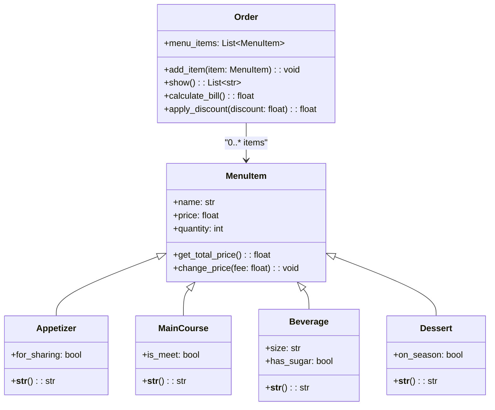

# Reto3-POO-SFGT
## Restaurant Order System


-----
En este repositorio se encuentran las soluciones a los dos ejercicios solicitados por el profesor, la clase `Rectangle` y `Order`.

## Menú

1. **Clase Rectangle**
   - Esta clase incluye métodos para trabajar con propiedades geométricas de figuras básicas, como el cálculo de áreas, perímetros y otras operaciones geométricas útiles.

2. **Clase Order**
   - Esta clase se encarga de manejar pedidos o listas de elementos, permitiendo la creación, modificación y seguimiento de órdenes.

---

## 1. Explicación de la creación de la clase Rectangle

Bueno, me falta eso...

---

## 2. Clases Cambiar las clases

- **`Order`**: La clase principal que representa la orden de un cliente. Puede contener múltiples elementos del menú.  
- **`MenuItem`**: Una clase base, que incluye atributos como nombre, precio y cantidad. Usado por cada tipo de ítem. 
- **Clases Derivadas**:  
  - `Appetizer`: Representa elementos destinados a compartir o como entradas.  
  - `MainCourse`: Representa platos principales, con un atributo opcional "is_meat".  
  - `Beverage`: Representa bebidas, con atributos como tamaño y contenido de azúcar.  
  - `Dessert`: Representa postres, con un atributo "on_season" para precios estacionales.  

### Código en Python
```python
import math

# Clase Punto
class Point:
    def __init__(self, x: float=0, y: float=0):
        self.x = x
        self.y = y
        self.__str__()

    def compute_distance(self, point: "Point")-> float:
        distance: float = ((self.x - point.x)**2+(self.y - point.y)**2)**(0.5)
        return distance

    def __str__(self) -> str:
        return f"({self.x}, {self.y})"


# Clase Rectángulo
class Rectangle:
    def __init__(self, method: int, *args):
        match method:
            case 1:
                # Caso esquina
                self.bl_corner, self.width, self.height = args
                new_x = (self.bl_corner.x + self.width) / 2
                new_y = (self.bl_corner.x - self.height) / 2
                self.center = Point(new_x, new_y)
            case 2:
                # Caso centro
                self.center, self.width, self.height = args
            case 3:
                # Caso esquinas opuestas
                self.corner1, self.corner2 = args
                if self.corner1.x == self.corner2.x and self.corner1.y == self.corner2.y:
                    raise ValueError("Seleccione puntos en diferentes ubicaciones del espacio.")
                self.width = abs(self.corner2.x - self.corner1.x)
                self.height = abs(self.corner2.y - self.corner1.y)
            case 4:
                self.line1, self.line2, self.line3, self.line4 = args
                
                # adjacent_dict = {} se puede eliminar esto
                opposite_lines = [] # [(line1, line3), (line2, line4)]
                for i in range(len(args)):
                    line = args[i]
                    adjacent_dict[str(line)] = []
                    x1, y1 = line.point1.x, line.point1.y
                    x2, y2 = line.point2.x, line.point2.y
                    opposite_line = None
                    for j in range(i + 1, len(args)):
                        next_line = args[j]
                        x3, y3 = next_line.point1.x, next_line.point1.y
                        x4, y4 = next_line.point2.x, next_line.point2.y

                        # Comparar cada punto
                        flag = False
                        if (x1==x3 and y1==y3) or (x1==x4 and y1==y4):
                            flag = True
                        if (x2==x3 and y2==y3) or (x2==x4 and y2==y4):
                            flag = True

                        # Significa que son adyacentes los segmentos
                        if flag:
                            adjacent_dict[str(line)].append(str(next_line))
                        else:
                            opposite_line = next_line
                            opposite_lines.append((line, next_line))

                # print(adjacent_dict)
                # print(opposite_lines)

                # Ya sabiendo las opuestas puedo ver
                line1, line3 = opposite_lines[0]
                line2, line4 = opposite_lines[1]
                condition_list = [
                    line1.compute_length() == line3.compute_length(),
                    line2.compute_length() == line4.compute_length(),
                    line1.compute_slope() == line3.compute_slope(),
                    line2.compute_slope() == line4.compute_slope()
                ]
                    
                for condition in condition_list:
                    if not condition:
                        raise ValueError("Introduzca líneas que formen un rectángulo")

                # Calcular width y height
                self.width = line1.compute_length()
                self.height = line2.compute_length()

            case _:
                raise ValueError("Ningún Método Seleccionado")


    # Estas funciones deben trabajar para cualquier método
    def compute_area(self) -> float:
        area: float = self.width * self.height
        return area

    def compute_perimeter(self) -> float:
        perimeter: float = (self.width + self.height) * 2
        return perimeter

    def compute_interference_point(self, point: "Point") -> bool:
        """Verificar si un punto está dentro de un rectángulo."""
        start_x, end_x = self.compute_width_range()
        start_y, end_y = self.compute_height_range()
        return (start_x <= point.x <= end_x) and (start_y <= point.y <= end_y)


    def compute_width_range(self) -> list[float]:
        """Obtener el dominio del rectángulo."""
        mid: float = self.width/2
        start: float = self.center.x - mid
        end: float = self.center.x + mid
        return [start, end]

    def compute_height_range(self) -> list[float]:
        """Obtener el rango del rectángulo."""
        mid: float = self.height / 2
        start: float = self.center.y - mid
        end: float = self.center.y + mid
        return [start, end]


    def compute_interference_line(self, line: "Line") -> bool:
        """Verificar si una linea/parte de ella está dentro de un rectángulo."""
        # Solo el caso base de mirar los puntos extremos
        return (self.compute_interference_point(line.point1) or self.compute_interference_point(line.point2))

        # Mirar si un segmento intersecta con el borde del rectángulo
        max_side: float = (self.height**2 + self.width**2)**0.5
        for corner in self.corners():
            if corner.compute_distance(point) > max_side:
                # Significa que el punto está por fuera
                break


# Clase Cuadrado
class Square(Rectangle):
    def __init__(self, method: int, *args):
        # Se llama a la clase padre y se inicializa
        if method == 1:
            super().__init__(1, args[0], args[1], args[1])
        elif method == 2:
            super().__init__(2, args[0], args[1], args[1])
        elif method == 3:
            super().__init__(3, args[0], args[1])


class Line:
    """Plantilla para representar una línea en un plano."""
    def __init__(self, point1: "Point", point2: "Point") -> None:
        self.point1 = point1
        self.point2 = point2
        self.length = self.compute_length()
        self.slope = self.compute_slope()
        self.line_points = []

    def compute_length(self) -> float:
        """Retorna la longitud de la línea."""
        length: float = ((self.point1.x - self.point2.x)**2 + (self.point1.y - self.point2.y)**2)**0.5
        return length

    def compute_slope(self):
        """Retorna en grados la pendiente de la línea."""
        co: int = abs(self.point1.y - self.point2.y)
        ca: int = abs(self.point1.x - self.point2.x)
        self.slope = (math.atan2(co, ca)) * (180/math.pi)
        return self.slope

    def compute_horizontal_cross(self) -> bool:
        """Verifica si hay intersección con el eje x."""
        if self.point1.y * self.point2.y <= 0:
            return True
        return False

    def compute_vertical_cross(self):
        """Verifica si hay intersección con el eje y."""
        if self.point1.x * self.point2.x <= 0:
            return True
        return False

    def discretize_line(self, n: int) -> list[float]:
        self.line_points = []

        # Hallar la distancia entre puntos
        distance_x = (self.point2.x-self.point1.x) / (n-1)
        distance_y = (self.point2.y-self.point1.y) / (n-1)
        # Crear n puntos
        for i in range(n):
            new_x = self.point1.x + (i * distance_x)
            new_y = self.point1.y + (i * distance_y)
            new_point = Point(new_x, new_y)
            self.line_points.append(new_point)

        return [str(point) for point in self.line_points]

    def __str__(self) -> str:
        return f"({self.point1.x}, {self.point1.y}) - ({self.point2.x}, {self.point2.y})"
```
---

## 1. Explicación del ejercicio

Se ha creado una clase Order donde contiene cada elemento consumido por el usuario, y cualquier consumidor en general. Se le impartirá el precio total a pagar. Se hace uso de herencia para simplificar la abstracción de la entrada, plato fuerte, bebida y postre, donde cada una es un item del menú. También se hace una asociación entre la clase Order y MenuItem, ya que la primera tiene varios MenuItem, usamos composición, pero un MenuItem no es una Orden. Por último, se aplican descuentos o tarifas si el consumidor pide una entrada para compartir o solicita una bebida con azúcar por ejemplo. 

P.D: Ya que el restaurante cree en la hermandad y el veganismo.

---

## 2. Clases

- **`Order`**: La clase principal que representa la orden de un cliente. Puede contener múltiples elementos del menú.  
- **`MenuItem`**: Una clase base, que incluye atributos como nombre, precio y cantidad. Usado por cada tipo de ítem. 
- **Clases Derivadas**:  
  - `Appetizer`: Representa elementos destinados a compartir o como entradas.  
  - `MainCourse`: Representa platos principales, con un atributo opcional "is_meat".  
  - `Beverage`: Representa bebidas, con atributos como tamaño y contenido de azúcar.  
  - `Dessert`: Representa postres, con un atributo "on_season" para precios estacionales.  

### Diagrama de Relaciones

A continuación se muestra una representación visual de las relaciones entre las clases:  




### Código en Python
```python
class Order:
    """Representation of a restaurant order."""

    def __init__(self) -> None:
        self.menu_items: list[MenuItem] = []

    def add_item(self, item: "MenuItem") -> None:
        """Add items to the list."""
        self.menu_items.append(item)

    def show(self) -> list[str]:
        """
        Returns a readable list of items.

        Converts each item in the order to a string.
        """
        return [str(item) for item in self.menu_items]

    def calculate_bill(self) -> float:
        """
        Calculates the total cost of the order.

        Returns the sum of the total price of all items.
        """
        return sum(item.get_total_price() for item in self.menu_items)

    def apply_discount(self, discount: float) -> float:
        """
        Applies a discount to the total order cost.

        Args:
            discount: The discount percentage as a decimal (e.g., 0.1 for 10%).

        Returns:
            The total cost after applying the discount.
        """
        total = self.calculate_bill()
        return total * (1 - discount)


class MenuItem:
    """Representation of a menu item."""

    def __init__(self, name: str, price: float, quantity: int) -> None:
        self.name = name
        self.price = price
        if self.price < 0:
            raise ValueError("Price cannot be negative!")
        self.quantity = quantity
        if self.quantity <= 0:
            raise ValueError("Quantity must be greater than zero!")

    def get_total_price(self) -> float:
        """Calculates and returns the total price of this item."""
        return self.price * self.quantity

    def change_price(self, fee: float) -> None:
        """
        Adjusts the price of an item.

        Args:
            fee: A multiplier factor to adjust the price.
        """
        self.price *= fee


class Appetizer(MenuItem):
    """Representation of an appetizer."""

    def __init__(
        self,
        name: str,
        price: float,
        quantity: int,
        for_sharing: bool
    ) -> None:
        super().__init__(name, price, quantity)
        self.for_sharing = for_sharing
        if self.for_sharing:
            self.change_price(0.95)

    def __str__(self) -> str:
        """Returns the name of the appetizer as a string."""
        return self.name


class MainCourse(MenuItem):
    """Representation of a main course."""

    def __init__(
        self,
        name: str,
        price: float,
        quantity: int,
        is_meet: bool
    ) -> None:
        super().__init__(name, price, quantity)
        self.is_meet = is_meet
        if self.is_meet:
            self.change_price(1.05)

    def __str__(self) -> str:
        """Returns the name of the main course as a string."""
        return self.name


class Beverage(MenuItem):
    """Representation of a beverage."""

    def __init__(
        self,
        name: str,
        price: float,
        quantity: int,
        size: str,
        has_sugar: bool
    ) -> None:
        super().__init__(name, price, quantity)
        self.size = size
        self.has_sugar = has_sugar
        if self.has_sugar:
            self.change_price(1.05)

    def __str__(self) -> str:
        """Returns the name of the beverage as a string."""
        return self.name


class Dessert(MenuItem):
    """Representation of a dessert."""

    def __init__(
        self,
        name: str,
        price: float,
        quantity: int,
        on_season: bool
    ) -> None:
        super().__init__(name, price, quantity)
        self.on_season = on_season
        if self.on_season:
            self.change_price(0.95)

    def __str__(self) -> str:
        """Returns the name of the dessert as a string."""
        return self.name
```
### Un LLM pide 10 cosas...
```python
# Crear una nueva orden
order = Order()

# Agregar 10 elementos de diferentes categorías
order.add_item(Appetizer(name="Nachos", price=5.50, quantity=2, for_sharing=True))
order.add_item(Appetizer(name="Spring Rolls", price=4.00, quantity=3, for_sharing=False))
order.add_item(MainCourse(name="Steak", price=15.00, quantity=1, is_meet=True))
order.add_item(MainCourse(name="Vegetarian Pasta", price=12.00, quantity=2, is_meet=False))
order.add_item(Beverage(name="Coca Cola", price=2.50, quantity=2, size="Medium", has_sugar=True))
order.add_item(Beverage(name="Orange Juice", price=3.00, quantity=1, size="Large", has_sugar=False))
order.add_item(Dessert(name="Cheesecake", price=6.00, quantity=1, on_season=True))
order.add_item(Dessert(name="Chocolate Cake", price=5.50, quantity=1, on_season=False))
order.add_item(Appetizer(name="Garlic Bread", price=3.50, quantity=1, for_sharing=True))
order.add_item(Beverage(name="Latte", price=4.00, quantity=1, size="Small", has_sugar=False))

# Mostrar los elementos en la orden
print("Items en la orden:")
print(order.show())
for item in order.show():
    print(f" -> {item}")


# Calcular el total de la cuenta
total = order.calculate_bill()
print(f"\nTotal de la cuenta: ${total:.2f}")

# Aplicar un descuento del 10%
discounted_total = order.apply_discount(0.10)
print(f"Total con descuento del 10%: ${discounted_total:.2f}")
```
### Resultado
Proporciono el resultado dado, hecho en Google Colab.

```bash
Items en la orden:
['Nachos', 'Spring Rolls', 'Steak', 'Vegetarian Pasta', 'Coca Cola', 'Orange Juice', 'Cheesecake', 'Chocolate Cake', 'Garlic Bread', 'Latte']
 -> Nachos
 -> Spring Rolls
 -> Steak
 -> Vegetarian Pasta
 -> Coca Cola
 -> Orange Juice
 -> Cheesecake
 -> Chocolate Cake
 -> Garlic Bread
 -> Latte

Total de la cuenta: $88.98
Total con descuento del 10%: $80.08
```


