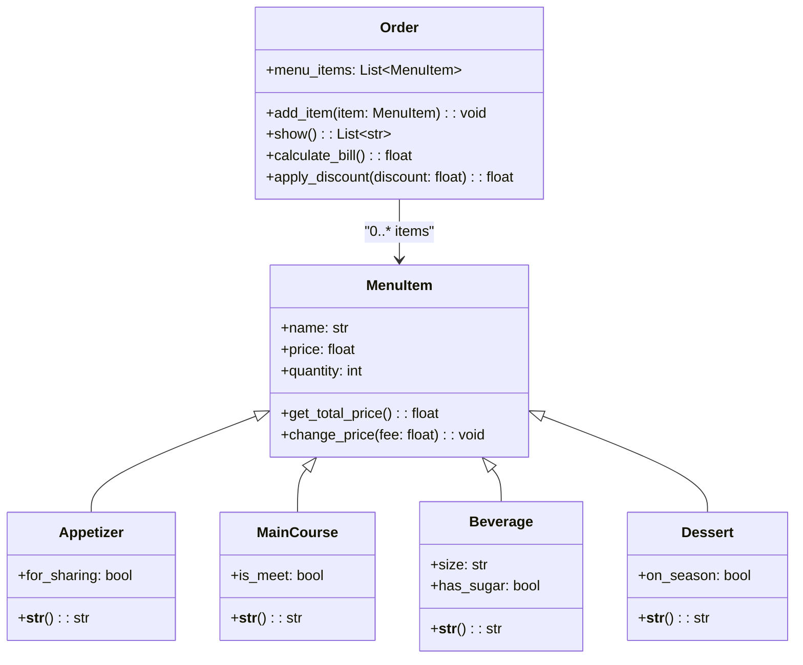

# Reto3-POO-SFGT
## Restaurant Order System

---

## 1. Explicación del ejercicio

Se ha creado una clase Order donde contiene cada elemento consumido por el usuario, y cualquier consumidor en general. Se le impartirá el precio total a pagar. Se hace uso de herencia para simplificar la abstracción de la entrada, plato fuerte, bebida y postre, donde cada una es un item del menú. También se hace una asociación entre la clase Order y MenuItem, ya que la primera tiene varios MenuItem, usamos composición, pero un MenuItem no es una Orden. Por último, se aplican descuentos o tarifas si el consumidor pide una entrada para compartir o solicita una bebida con azúcar por ejemplo. 

P.D: Ya que el restaurante cree en la hermandad y el veganismo.

---

## 2. Clases

- **`Order`**: La clase principal que representa la orden de un cliente. Puede contener múltiples elementos del menú.  
- **`MenuItem`**: Una clase base, que incluye atributos como nombre, precio y cantidad. Usado por cada tipo de ítem. 
- **Clases Derivadas**:  
  - `Appetizer`: Representa elementos destinados a compartir o como entradas.  
  - `MainCourse`: Representa platos principales, con un atributo opcional "is_meat".  
  - `Beverage`: Representa bebidas, con atributos como tamaño y contenido de azúcar.  
  - `Dessert`: Representa postres, con un atributo "on_season" para precios estacionales.  

### Diagrama de Relaciones

A continuación se muestra una representación visual de las relaciones entre las clases:  




### Código en Python
```python
class Order:
    """Representation of a restaurant order."""

    def __init__(self) -> None:
        self.menu_items: list[MenuItem] = []

    def add_item(self, item: "MenuItem") -> None:
        """Add items to the list."""
        self.menu_items.append(item)

    def show(self) -> list[str]:
        """
        Returns a readable list of items.

        Converts each item in the order to a string.
        """
        return [str(item) for item in self.menu_items]

    def calculate_bill(self) -> float:
        """
        Calculates the total cost of the order.

        Returns the sum of the total price of all items.
        """
        return sum(item.get_total_price() for item in self.menu_items)

    def apply_discount(self, discount: float) -> float:
        """
        Applies a discount to the total order cost.

        Args:
            discount: The discount percentage as a decimal (e.g., 0.1 for 10%).

        Returns:
            The total cost after applying the discount.
        """
        total = self.calculate_bill()
        return total * (1 - discount)


class MenuItem:
    """Representation of a menu item."""

    def __init__(self, name: str, price: float, quantity: int) -> None:
        self.name = name
        self.price = price
        if self.price < 0:
            raise ValueError("Price cannot be negative!")
        self.quantity = quantity
        if self.quantity <= 0:
            raise ValueError("Quantity must be greater than zero!")

    def get_total_price(self) -> float:
        """Calculates and returns the total price of this item."""
        return self.price * self.quantity

    def change_price(self, fee: float) -> None:
        """
        Adjusts the price of an item.

        Args:
            fee: A multiplier factor to adjust the price.
        """
        self.price *= fee


class Appetizer(MenuItem):
    """Representation of an appetizer."""

    def __init__(
        self,
        name: str,
        price: float,
        quantity: int,
        for_sharing: bool
    ) -> None:
        super().__init__(name, price, quantity)
        self.for_sharing = for_sharing
        if self.for_sharing:
            self.change_price(0.95)

    def __str__(self) -> str:
        """Returns the name of the appetizer as a string."""
        return self.name


class MainCourse(MenuItem):
    """Representation of a main course."""

    def __init__(
        self,
        name: str,
        price: float,
        quantity: int,
        is_meet: bool
    ) -> None:
        super().__init__(name, price, quantity)
        self.is_meet = is_meet
        if self.is_meet:
            self.change_price(1.05)

    def __str__(self) -> str:
        """Returns the name of the main course as a string."""
        return self.name


class Beverage(MenuItem):
    """Representation of a beverage."""

    def __init__(
        self,
        name: str,
        price: float,
        quantity: int,
        size: str,
        has_sugar: bool
    ) -> None:
        super().__init__(name, price, quantity)
        self.size = size
        self.has_sugar = has_sugar
        if self.has_sugar:
            self.change_price(1.05)

    def __str__(self) -> str:
        """Returns the name of the beverage as a string."""
        return self.name


class Dessert(MenuItem):
    """Representation of a dessert."""

    def __init__(
        self,
        name: str,
        price: float,
        quantity: int,
        on_season: bool
    ) -> None:
        super().__init__(name, price, quantity)
        self.on_season = on_season
        if self.on_season:
            self.change_price(0.95)

    def __str__(self) -> str:
        """Returns the name of the dessert as a string."""
        return self.name
```
### Un LLM pide 10 cosas...
```python
# Crear una nueva orden
order = Order()

# Agregar 10 elementos de diferentes categorías
order.add_item(Appetizer(name="Nachos", price=5.50, quantity=2, for_sharing=True))
order.add_item(Appetizer(name="Spring Rolls", price=4.00, quantity=3, for_sharing=False))
order.add_item(MainCourse(name="Steak", price=15.00, quantity=1, is_meet=True))
order.add_item(MainCourse(name="Vegetarian Pasta", price=12.00, quantity=2, is_meet=False))
order.add_item(Beverage(name="Coca Cola", price=2.50, quantity=2, size="Medium", has_sugar=True))
order.add_item(Beverage(name="Orange Juice", price=3.00, quantity=1, size="Large", has_sugar=False))
order.add_item(Dessert(name="Cheesecake", price=6.00, quantity=1, on_season=True))
order.add_item(Dessert(name="Chocolate Cake", price=5.50, quantity=1, on_season=False))
order.add_item(Appetizer(name="Garlic Bread", price=3.50, quantity=1, for_sharing=True))
order.add_item(Beverage(name="Latte", price=4.00, quantity=1, size="Small", has_sugar=False))

# Mostrar los elementos en la orden
print("Items en la orden:")
print(order.show())
for item in order.show():
    print(f" -> {item}")


# Calcular el total de la cuenta
total = order.calculate_bill()
print(f"\nTotal de la cuenta: ${total:.2f}")

# Aplicar un descuento del 10%
discounted_total = order.apply_discount(0.10)
print(f"Total con descuento del 10%: ${discounted_total:.2f}")
```
### Resultado
Proporciono el resultado dado, hecho en Google Colab.

```bash
Items en la orden:
['Nachos', 'Spring Rolls', 'Steak', 'Vegetarian Pasta', 'Coca Cola', 'Orange Juice', 'Cheesecake', 'Chocolate Cake', 'Garlic Bread', 'Latte']
 -> Nachos
 -> Spring Rolls
 -> Steak
 -> Vegetarian Pasta
 -> Coca Cola
 -> Orange Juice
 -> Cheesecake
 -> Chocolate Cake
 -> Garlic Bread
 -> Latte

Total de la cuenta: $88.98
Total con descuento del 10%: $80.08
```


